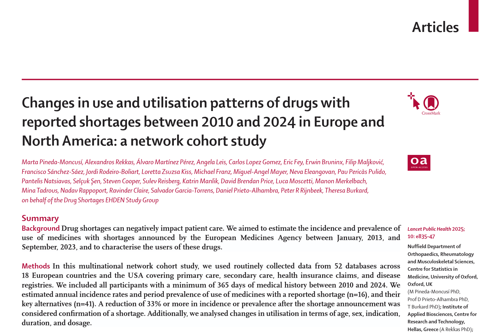
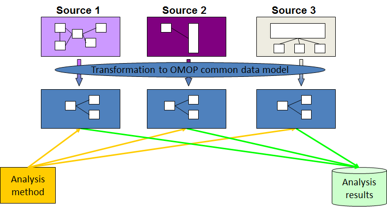
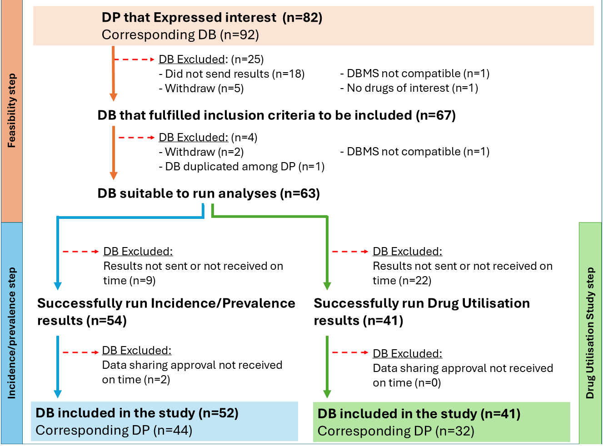
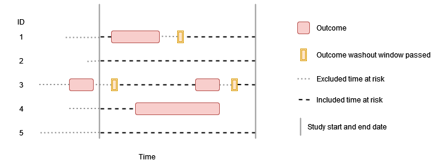
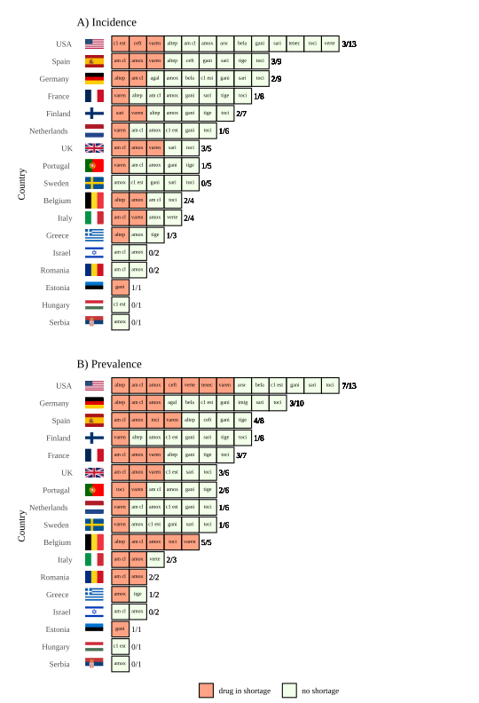
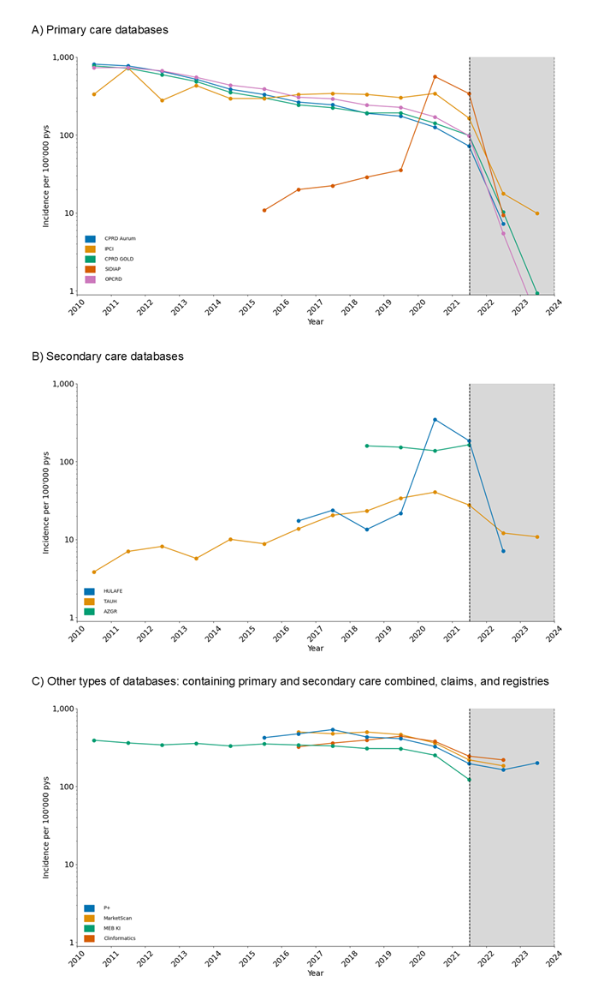
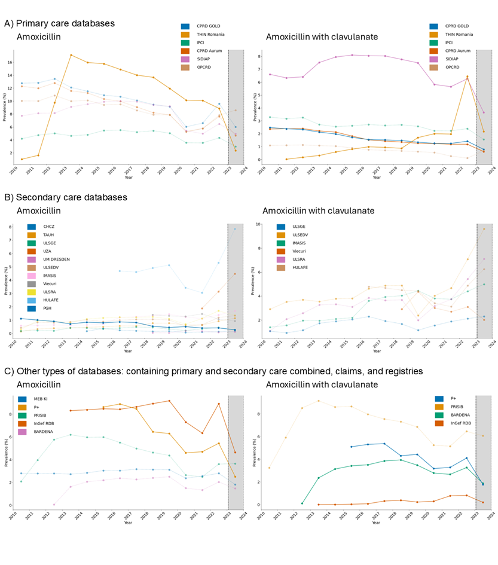
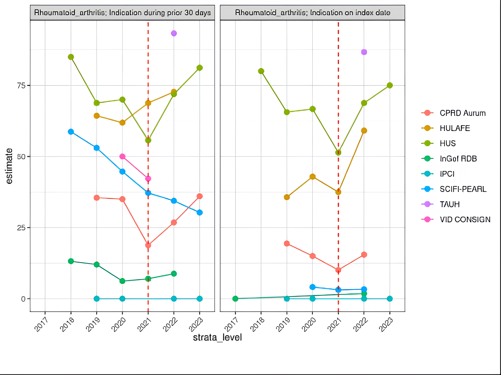

# Η μελέτη

```{=html}
<script>
(function() {
  var scale = 1, minScale = 0.5, maxScale = 10; var tx = 0, ty = 0; var dragging = false, lastX = 0, lastY = 0;

  var overlay = document.createElement('div');
  overlay.id = 'img-overlay';
  overlay.style.cssText = 'display:none;position:fixed;top:0;left:0;width:100vw;height:100vh;background:rgba(0,0,0,0.92);z-index:99999;overflow:hidden;cursor:grab;';

  var img = document.createElement('img');
  img.id = 'zoom-img';
  img.draggable = false;
  img.style.cssText = 'position:absolute;top:50%;left:50%;height:90vh;width:auto;max-width:none;display:block;transform-origin:center center;user-select:none;pointer-events:none;';

  function applyTransform() {
    img.style.transform = 'translate(calc(-50% + ' + tx + 'px), calc(-50% + ' + ty + 'px)) scale(' + scale + ')';
  }

  overlay.addEventListener('wheel', function(e) {
    e.preventDefault();
    e.stopPropagation();
    scale = Math.min(maxScale, Math.max(minScale, scale * (e.deltaY > 0 ? 0.9 : 1.1)));
    applyTransform();
  }, { passive: false, capture: true });

  overlay.addEventListener('pointerdown', function(e) {
    if (e.target === closeBtn) return;
    dragging = true;
    lastX = e.clientX; lastY = e.clientY;
    overlay.style.cursor = 'grabbing';
    overlay.setPointerCapture(e.pointerId);
    e.stopPropagation();
  }, true);

  overlay.addEventListener('pointermove', function(e) {
    if (!dragging) return;
    tx += e.clientX - lastX; ty += e.clientY - lastY;
    lastX = e.clientX; lastY = e.clientY;
    applyTransform();
    e.stopPropagation();
  }, true);

  overlay.addEventListener('pointerup', function(e) {
    dragging = false;
    overlay.style.cursor = 'grab';
    e.stopPropagation();
  }, true);

  ['mousedown','mousemove','mouseup','click',
   'touchstart','touchmove','touchend',
   'keydown','keyup'].forEach(function(t) {
    overlay.addEventListener(t, function(e) {
      e.stopPropagation();
      e.stopImmediatePropagation();
    }, true);
  });

  var closeBtn = document.createElement('button');
  closeBtn.textContent = '✕  Κλείσιμο';
  closeBtn.style.cssText = 'position:absolute;top:16px;right:24px;background:rgba(255,255,255,0.2);color:#fff;border:1px solid rgba(255,255,255,0.4);font-size:22px;cursor:pointer;border-radius:6px;padding:6px 18px;z-index:100000;';
  closeBtn.addEventListener('click', function(e) {
    e.stopPropagation();
    closeOverlay();
  });

  var hint = document.createElement('div');
  hint.textContent = '🖱 Scroll to zoom · Drag to pan · Esc to close';
  hint.style.cssText = 'position:absolute;bottom:20px;left:50%;transform:translateX(-50%);color:rgba(255,255,255,0.55);font-size:18px;pointer-events:none;white-space:nowrap;';

  overlay.appendChild(img);
  overlay.appendChild(closeBtn);
  overlay.appendChild(hint);
  document.body.appendChild(overlay);

  function closeOverlay() {
    overlay.style.display = 'none';
    if (window.Reveal) Reveal.configure({ keyboard: true, touch: true });
  }

  document.addEventListener('keydown', function(e) {
    if (e.key === 'Escape' && overlay.style.display !== 'none') {
      e.stopPropagation();
      e.preventDefault();
      closeOverlay();
    }
  }, true);

  window.openZoom = function(src) {
    img.src = src;
    scale = 1; tx = 0; ty = 0;
    applyTransform();
    overlay.style.display = 'block';
    if (window.Reveal) Reveal.configure({ keyboard: false, touch: false });
  };
})();
</script>

```
## Η μελέτη





## Εισαγωγικά

\

* Οι ελλείψεις βασικών φαρμάκων αυξάνουν τη θνησιμότητα / τις ανεπιθύμητες ενέργειες.
* Ο ΠΟΥ θεωρεί το φαινόμενο μια σύνθετη παγκόσμια πρόκληση.
* Ο Ευρωπαϊκός Οργανισμός Φαρμάκων (EMA) διατηρεί δημόσιο κατάλογο φαρμάκων υπό επιτήρηση.

\

> **Στόχος**
>
> Η εκτίμηση της επίπτωσης (incidence), του επιπολασμού (prevalence)
> και των αλλαγών στη χρήση φαρμάκων που ανακοινώθηκαν σε έλλειψη από τον EMA.


## Στόχοι της μελέτης
* Διερεύνηση της επίπτωσης και του επιπολασμού περιόδου για φάρμακα με αναφερόμενες ελλείψεις ανά ημερολογιακό έτος.
* Περιγραφή των αλλαγών στο προφίλ των νέων και υφιστάμενων χρηστών.
* 57 φάρμακα συνολικά (16 σε έλλειψη, 41 εναλλακτικά) για την περίοδο 2010–2024.

# Το κοινό μοντέλο OMOP-CDM

## Γενικά


     
## Εκτέλεση μελετών

<div style="width:80%; height:820px; overflow:hidden;">

</div>

## HADES

<div style="width:80%; height:820px; overflow:hidden;">
  <iframe
    src="https://ohdsi.github.io/Hades/packages.html"
    style="
      width: 166%;
      height: 1366px;
      border: none;
      transform-origin: top left;
    "
    loading="lazy">
  </iframe>
</div>


# EHDEN Mega-Study

## Ανάλυση
* Χρήση του OMOP-CDM μέσω του δικτύου EHDEN.
* Ο αναλυτικός κώδικας γράφτηκε κεντρικά (σε `R`).
* Ο κώδικας εκτελέστηκε *τοπικά* από κάθε συνεργάτη-κάτοχο δεδομένων.
* Μοιράστηκαν μόνο συγκεντρωτικά αποτελέσματα.

## Δεδομένα

:::: {.columns}

::: {.column width="50%"}

:::
::: {.column width="50%"}
* _Εκδήλωση ενδιαφέροντος:_  
82 συνεργάτες του δικτύου EHDEN, εκπροσωπώντας 92 βάσεις δεδομένων.
* _Τελική ένταξη:_  
63 βάσεις δεδομένων πέρασαν επιτυχώς τους ελέγχους ποιότητας και δυνατότητας
υλοποίησης (Feasibility).
* _Γεωγραφική κατανομή:_  
18 Ευρωπαϊκές χώρες (συμπεριλαμβανομένης της Ελλάδας) και οι ΗΠΑ.
* _Τύποι δεδομένων:_  
Πρωτοβάθμια φροντίδα, δευτεροβάθμια φροντίδα (νοσοκομεία), δεδομένα ασφαλιστικών αποζημιώσεων (claims) και μητρώα ασθενειών.
:::

::::

## Βάσεις δεδομένων
```{r, echo=FALSE}
library(DT)
databases <- data.frame(
  Ακρωνύμιο = c("ULSRA","ULSEDV","ULSGE","AP-HM","COMNET MODENA","IMASIS","POLIMI","AOUPR","ATENEA","AZGR","BARDENA","BDR","BZMC","CHA CAN","CHCZ","CPRD GOLD","CPRD Aurum","GMC","HULAFE","HUS","InGef RDB","INT","IPCI","ITF CDM","MAITT","UZA","MarketScan","NCR","OLVA MS","H12O","OPCRD","Clinformatics","PGH","P+","PRISIB","ReumaPT","SCIFI-PEARL","SIDIAP","PSSJD","SUCD","MEB KI","TAUH","THIN Belgium","THIN Spain","THIN France","THIN Italy","THIN Romania","THIN UK","UM DRESDEN","PCASF","VID CONSIGN","Viecuri"),
  Πλήρης_Ονομασία = c("Unidade Local de Saúde da Região de Aveiro","Unidade Local de Saúde de Entre Douro e Vouga","Unidade Local de Saúde de Gaia e Espinho","L'Assistance Publique — Hôpitaux de Marseille","Modena Cancer Center of the AOU Policlinico","Hospital del Mar EHR Information System","Foundation IRCCS Ca' Granda Ospedale Maggiore Policlinico","University Hospital of Parma","Marina Salud SA (Hospital de Denia)","AZ Groeninge","BARDENA","Bulgarian Diabetes Register","Bnai Zion Medical Center","Charité Cancer","Clinical Hospital Center Zvezdara","Clinical Practice Research Datalink GOLD","Clinical Practice Research Datalink Aurum","Galilee Medical Center","Health Department Valencia-La Fe","Helsinki University Hospital","InGef Research Database","National Cancer Institute Milano DWH","The Integrated Primary Care Information","Istanbul University Istanbul Faculty of Medicine","Masinõppe ja AI toega teenused","University Hospital Antwerp","Merative MarketScan","Netherlands Cancer Registry","Onze-Lieve-Vrouwziekenhuis Aalst-Asse-Ninove","Hospital 12 Octubre","Optimum Patient Care Research Database","Optum Clinformatics","Papageorgiou General Hospital","IQVIA Pharmetrics+","PRISIB","Rheumatic Diseases Portuguese Registry","Swedish COVID-19 Investigation for Future Insights","The Information System for Research in Primary Care","Parc Sanitari Sant Joan de Déu","Semmelweis University Clinical Database","MEB KI","Tampere University Hospital","THIN Belgium","THIN Spain","THIN France","THIN Italy","THIN Romania","THIN UK","University Medicine Dresden","University of Turku (Prostate Cancer Registry SW Finland)","Valencia Health System Integrated Database","VieCuri Medical Center Rheumatology Database"),
  Περίοδος = paste0(c(2010,2010,2010,2014,2011,2010,2016,2021,2014,2018,2012,2018,2020,2010,2014,2010,2010,2013,2016,2010,2013,2010,2010,2018,2012,2018,2016,2010,2015,2011,2010,2016,2010,2015,2010,2010,2018,2010,2017,2011,2010,2010,2010,2013,2010,2010,2010,2010,2018,2010,2018,2018), " – ", c(2023,2023,2023,2024,2023,2024,2024,2022,2024,2022,2023,2018,2024,2023,2024,2023,2023,2024,2023,2024,2023,2024,2023,2021,2019,2023,2022,2023,2024,2021,2024,2022,2023,2023,2023,2022,2023,2023,2023,2022,2023,2023,2023,2023,2023,2023,2023,2023,2023,2022,2021,2023)),
  Τύπος = c("Secondary","Secondary","Secondary","Secondary","Secondary","Secondary","Secondary","Secondary","Secondary","Secondary","EHR/Mixed","Registry","Secondary","Secondary","Secondary","Primary","Primary","Secondary","EHR/Mixed","Secondary","Claims/Mixed","Secondary","Primary","Secondary","Claims/Mixed","Secondary","Claims/Mixed","Registry","Secondary","Secondary","Primary","Claims/Mixed","Secondary","Claims/Mixed","EHR/Mixed","Registry","EHR/Mixed","Primary","Secondary","Secondary","EHR/Mixed","Secondary","Primary","Primary","Primary","Primary","Primary","Primary","Secondary","Secondary","EHR/Mixed","Secondary"),
  Χώρα = c("Portugal","Portugal","Portugal","France","Italy","Spain","Italy","Italy","Spain","Belgium","Spain","Bulgaria","Israel","Germany","Serbia","UK","UK","Israel","Spain","Finland","Germany","Italy","Netherlands","Türkiye","Estonia","Belgium","USA","Netherlands","Belgium","Spain","UK","USA","Greece","USA","Spain","Portugal","Sweden","Spain","Spain","Hungary","Sweden","Finland","Belgium","Spain","France","Italy","Romania","UK","Germany","Finland","Spain","Netherlands"),
  Άτομα = format(c(514014,562687,728107,2806891,89211,1084151,1447865,573205,356723,68918,1972272,501065,1075585,214443,618992,17267137,44851398,947455,2371896,480286,9111064,1296676,2817331,899515,149364,49011,176890290,2514888,51278,2891589,25953068,77234542,1410224,159649500,2498289,28325,11686191,8553325,659817,2075672,3403513,2878001,2023580,1896031,25949765,1225836,1135795,10977326,624697,22232,1964588,4918), big.mark = ",", scientific = FALSE)
)

datatable(
  databases,
  colnames = c("Ακρωνύμιο", "Πλήρης ονομασία", "Περίοδος", "Τύπος", "Χώρα", "Πλήθος ασθενών"),
  options = list(
    pageLength = 18,
    scrollY = "800px",
    scrollCollapse = FALSE,
    dom = "ftp",
    language = list(search = "Search:"),
    columnDefs = list(list(className = "dt-right", targets = 5)),
    order = list(list(4, "asc"), list(0, "asc")),
    initComplete = JS("function(settings, json) {
      $(this.api().table().node()).css('font-size', '24px');
    }")
  ),
  rownames = FALSE,
  class = "compact stripe hover"
)

```

## Γ.Ν. Παπαγεωργίου (ΠΓΝ)
* _Η βάση δεδομένων:_  
Το ΠΓΝ  είναι ένα από τα μεγαλύτερα δημόσια νοσοκομεία στη Βόρεια Ελλάδα / Κεντρική Μακεδονία.
* _Το προφίλ των δεδομένων:_  
Καλύπτει ~1,5 εκατομμύριο ασθενείς, περιλαμβάνοντας κλινικά, διοικητικά και εργαστηριακά δεδομένα από το 2000.

## Δυνατότητα υλοποίησης (Feasibility)
* Δοκιμαστικές εκτελέσεις (test runs) σε υποσύνολα δεδομένων.
* Απαραίτητη προϋπόθεση ήταν η καταγραφή *τουλάχιστον 100 ατόμων* με συνταγογράφηση/χορήγηση του φαρμάκου ενδιαφέροντος κατά την περίοδο της μελέτης.
* Χρησιμοποιήθηκαν εργαλεία αξιολόγησης της ποιότητας δεδομένων του OHDSI (`DataQualityDashboard`).


## Επιτροπές βιοηθικής
* Σε τοπικό επίπεδο λόγω του αποκεντρωμένου σχεδιασμού.
* Οι συνεργάτες έλαβαν έγκριση από την τοπική Επιτροπή Ηθικής και Δεοντολογίας (IRB) ή επίσημη απαλλαγή βάσει της εθνικής νομοθεσίας τους.


## Μελέτη επίπτωσης και επιπολασμού
* _Πληθυσμός:_  
Όλα τα άτομα στη βάση δεδομένων με τουλάχιστον 365 ημέρες διαθέσιμου ιατρικού ιστορικού.
* _Περίοδος έκπλυσης (washout period):_  
Για τον υπολογισμό της επίπτωσης (νέοι χρήστες), εφαρμόστηκε περίοδος 30 ημερών χωρίς χρήση του φαρμάκου πριν τη νέα συνταγογράφηση.
* _Παρονομαστής:_  
Υπολογίστηκε ως ανθρωπο-έτη σε κίνδυνο (person-years) για την επίπτωση, και ως πληθυσμός σε κίνδυνο για τον επιπολασμό.

## Μελέτη επίπτωσης

\

::: {style="width:70%; margin: 0 auto;"}

:::


## Μελέτη χρήσης φαρμάκων (Drug Utilization Study - DUS)
* Νέοι (incident) και υφιστάμενοι (prevalent) χρήστες.
* **Χαρακτηρισμός σε Επίπεδο Ασθενούς:**
  * *Δημογραφικά:* Ηλικία και φύλο κατά την έναρξη.
  * *Ενδείξεις:* Εκτιμήθηκαν μέσω κωδικών διάγνωσης (SNOMED) στις 30 ημέρες πριν ή κατά την ημερομηνία έναρξης (index date).
  * *Διάρκεια Θεραπείας:* Υπολογίστηκε από τα δεδομένα χορήγησης/συνταγογράφησης.
  * *Δοσολογία:* Εκτιμώμενη ημερήσια δόση.

## 9. Ορισμός Στατιστικών Μετρικών
* **Ποσοστό Επίπτωσης (Incidence Rate):**
  * *Τύπος:* Νέοι Χρήστες / Ανθρωπο-έτη σε κίνδυνο (Person-years at risk).
  * *Αβεβαιότητα:* 95% Διαστήματα Εμπιστοσύνης (ΔΕ) με την ακριβή μέθοδο Poisson.
* **Επιπολασμός Περιόδου (Period Prevalence):**
  * *Τύπος:* Σύνολο Χρηστών / Πληθυσμός σε κίνδυνο μέσα σε ένα ημερολογιακό έτος.
  * *Αβεβαιότητα:* 95% Διωνυμικά (Binomial) Διαστήματα Εμπιστοσύνης.

::: {.notes}
*Σημείωση ομιλητή (Focus στη στατιστική):* Αναφέρετε ότι επιλέξαμε την ακριβή μέθοδο Poisson υποθέτοντας απουσία υπερδιασποράς (no overdispersion) και ανεξαρτησία συμβάντων στο χρόνο, που είναι standard επιδημιολογική προσέγγιση για τέτοιου είδους μεγάλα σύνολα δεδομένων.
:::

## Ορισμός "έλλειψης"
* Ορίσαμε ως "αντίκτυπο έλλειψης" μια **$\ge$ 33% σχετική μείωση** στην επίπτωση ή τον επιπολασμό.
* Συγκρίναμε τη διάμεσο των 3 ετών *πριν* την ανακοίνωση του EMA με τη διάμεσο των 3 ετών *μετά* την ανακοίνωση.

## Συνολικά αποτελέσματα
* 15 από τα 16 φάρμακα είχαν δεδομένα επίπτωσης (όλα είχαν δεδομένα επιπολασμού).
* 8 φάρμακα εμφάνισαν $\ge$ 33% πτώση στους νέους χρήστες (επίπτωση).
* 9 φάρμακα εμφάνισαν $\ge$ 33% πτώση στους συνολικούς χρήστες (επιπολασμός).
* Τα φάρμακα που επηρεάστηκαν περισσότερο:
  * Βαρενικλίνη (διακοπή καπνίσματος)
  * Αμοξικιλλίνη (αντιβιοτικό)


## Συνολικά αποτελέσματα


     
## Βαρενικλίνη
* Ανακοίνωση του EMA (Ιούνιος 2021) λόγω ανίχνευσης προσμίξεων (Ν-νιτροζο-βαρενικλίνη).
* Η επίπτωση έπεσε $\ge$ 33% σε 12 βάσεις.
* Ο επιπολασμός έπεσε σε 13 βάσεις (επηρεάζοντας 16 από τις 18 χώρες).
* Μετρήσιμη, αντισταθμιστική αύξηση στη συχνότητα χρήσης θεραπειών υποκατάστασης νικοτίνης (εναλλακτικά) σε αρκετές βάσεις (π.χ. Ολλανδία, Βέλγιο).

## Βαρενικλίνη (επίπτωση)



## Αλλαγές στη διάρκεια θεραπείας


* Η αθροιστική δόση έπεσε από διάμεσο 84 mg (2020) στα 28 mg (2023) στην πρωτοβάθμια φροντίδα (Ολλανδία).
* **Διάρκεια Θεραπείας:** Στη Φινλανδία (από 104 ημέρες σε μόλις 1) και στο Βέλγιο (από 71 ημέρες στις 30).


## Αμοξικιλλίνη

* Έλλειψη (Ιανουάριος 2023) λόγω καθυστερήσεων στην παραγωγή + έξαρσης αναπνευστικών λοιμώξεων μετά την πανδημία COVID-19.
* Ο επιπολασμός έπεσε στο 55% των βάσεων πρωτοβάθμιας φροντίδας και περίπου στο 45% των νοσοκομειακών.
* Παρατηρήσαμε τοπικές αυξήσεις σε εναλλακτικά αντιβιοτικά όπως η Αζιθρομυκίνη, κυρίως στη δευτεροβάθμια φροντίδα.

## Αμοξικιλλίνη (επιπολασμός)




## Σαριλουμάμπη

::: {.columns}

::: {.column width="50%"}

* Θεραπεία για τη Ρευματοειδή Αρθρίτιδα (ΡΑ).
* Απότομη πτώση στη χρήση του για ΡΑ και ταυτόχρονη αύξηση στο ποσοστό των *ανδρών* χρηστών.
* Eκτός ένδειξης (off-label) χρήση για σοβαρή νόσηση από COVID-19.

:::

::: {.column width="50%"}


     
:::
:::

## Αποτελέσματα Ελλάδας

* Στο ΠΓΝ αξιολογήθηκαν 3 φάρμακα (αμοξικιλλίνη, τιγεκυκλίνη και αλτεπλάση)
* **Αμοξικιλλίνη:** ΔΕΝ ξεπεράστηκε το κατώφλι της μείωσης κατά 33%
* **Τιγεκυκλίνη:** Εμφάνισε μείωση $\ge$ 33%.
* **Αλτεπλάση:** ΔΕΝ ξεπεράστηκε το κατώφλι της μείωσης κατά 33%

## Περιορισμοί
* Συνταγογράφηση δεν σημαίνει κατανάλωση από τον ασθενή.
* Μη συνταγογραφούμενα εναλλακτικά (π.χ. επιθέματα νικοτίνης) υποεκπροσωπούνται.
* Χρησιμοποιήσαμε κωδικούς SNOMED ως δείκτες για την ένδειξη χορήγησης των φαρμάκων.
* Η επίδραση της πανδημίας COVID-19 .

## Συμπεράσματα
1. Οι ελλείψεις φαρμάκων διαταράσσουν ποσοτικά τη φροντίδα των ασθενών, οδηγώντας σε μετρήσιμες πτώσεις (επίπτωση/επιπολασμός) και αναγκάζοντας αλλαγές στη δόση, τη διάρκεια και τη χρήση εναλλακτικών θεραπειών.
2. Τυποποιημένα μοντέλα (όπως το OMOP-CDM) μας επιτρέπουν να παρακολουθούμε παγκόσμιες κρίσεις υγείας με ασφάλεια και διαφάνεια.

# Ευχαριστώ

